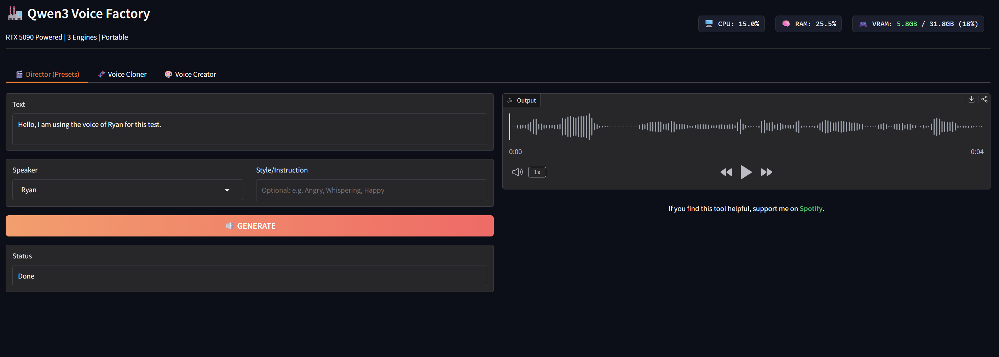

# 🏭 Qwen3 Voice Factory（GTX 1060 6GB 優化版）

一個本地、可攜式的 [Qwen3-TTS](https://huggingface.co/Qwen/Qwen3-TTS-12Hz-0.6B-Base) 圖形介面工具。
本分支針對 **NVIDIA GTX 1060 6GB（Pascal 架構）** 進行優化，改用 **0.6B 模型** 以避免 VRAM 不足造成的 CUDA illegal memory access 錯誤。

> **🎯 適合使用舊世代顯卡，又想在本地快速測試 Qwen3-TTS 的使用者。**

## 功能特色

- **🎬 導演模式（Director Mode）：** 使用 `Qwen3-TTS-12Hz-0.6B-CustomVoice`，可選擇預設角色（Ryan、Vivian）並下達情境指令（例如「憤怒」、「耳語」）。
- **🧬 語音複製（Voice Cloner）：** 使用 `Qwen3-TTS-12Hz-0.6B-Base`，上傳一段短音訊（3–5 秒）即可複製該聲音。
- **🎨 語音創作（Voice Creator）：** 使用 `Qwen3-TTS-12Hz-1.7B-VoiceDesign`，透過文字描述從零創造全新的聲音。
- **🔁 VRAM 自動管理：** 切換分頁時會自動卸載其他模型，避免 6GB VRAM 爆滿。
- **📊 即時硬體監控：** 內建即時儀表板，可在生成過程中監看 VRAM／RAM／CPU 使用率。
- **⏱ 生成時間顯示：** Voice Cloner 的 Status 欄位會顯示本次推論花費的秒數。
- **📂 自動儲存：** 會自動建立 `outputs_audio` 資料夾，並以時間戳記保存每次生成的音檔。
- **🔌 MCP Server：** 透過 Gradio 內建的 `/gradio_api/mcp/` 端點，可由 N8N 等 MCP Client 呼叫。
- **可攜式設計：** 不會修改 Windows 系統設定，所有內容都集中在單一資料夾內。

## 本機實測環境

- **OS：** Windows 10 Pro（19045）
- **GPU：** NVIDIA GeForce GTX 1060 6GB（Pascal, CUDA 12.1）
- **Python：** 3.11（獨立的 `python_env/`）
- **PyTorch：** 2.5.1+cu121 / torchvision 0.20.1+cu121
- **dtype：** `bfloat16`（Pascal 上相對穩定；`float16` 會讓 Mimi codec 產生 NaN）
- **device_map：** `"cuda"`（繞過 accelerate offload hooks，在 Pascal 上較不穩定）
- **attn_implementation：** `"eager"`
- **實測：** Voice Cloner 0.6B 單次推論約 47 秒，VRAM 使用約 3GB（49%）。

## 安裝方式

1. 將此 repository 下載為 ZIP 檔並解壓縮。
2. 雙擊執行 `install.bat`。
   - 此腳本會自動下載獨立的 Python 3.11 環境至 `python_env/`。
   - 並安裝 PyTorch 2.5.1+cu121 等相依套件。
3. 等待安裝完成。

## 使用方式

1. 雙擊執行 `start.bat`。
2. 瀏覽器會自動開啟至 `http://127.0.0.1:7880`。
3. MCP 端點：`http://127.0.0.1:7880/gradio_api/mcp/`。

## 模型說明
首次使用各分頁時，模型會從 HuggingFace 自動下載。使用 0.6B 模型約 1.2GB，1.7B Designer 模型約 3.4GB，請確保磁碟空間足夠。

## 系統需求

- Windows 10／11
- NVIDIA 顯示卡（建議 6GB 以上 VRAM；12GB 以上可換回 1.7B 模型）
- 網路連線（安裝及下載模型時需要）

## 🔗 致謝與來源

本專案是一個 GUI 封裝工具，目的是讓 **Qwen 團隊** 的優秀成果更容易被一般使用者取用。所有 AI 能力皆由其模型提供。

- **基礎模型：** 由 [Alibaba Cloud／Qwen Team](https://huggingface.co/Qwen) 開發。
- 歡迎到 HuggingFace 和 GitHub 支持他們的原創作品。

## 🤝 支持作者

這是一個免費的開源專案，我不接受捐款。
不過如果您想表達「感謝」，歡迎到 **[Spotify](https://open.spotify.com/artist/7EdK2cuIo7xTAacutHs9gv?si=4AqQE6GcQpKJFeVk6gJ06g)** 看看我的作品。

一個追蹤或一次聆聽，就是對我最好的支持！🎧
